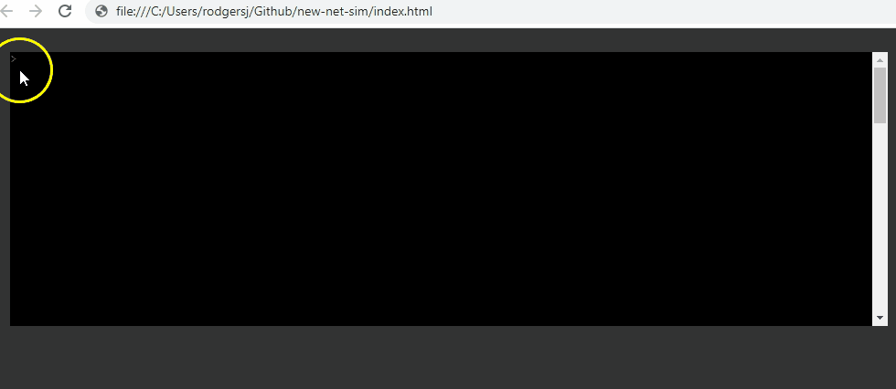

# new-net-sim
 console only LAN simulator in JavaScript  
 
 
 
## Concept
 The basic idea is to have a terminal like interface embedded in a web page in which
 you may enter commands that construct networks, generating PCs, switches, and routers 
 that you may configure and interact with. A simple table will be dynamically generated on 
 the page to help you visually keep track of what you've built so far. 

## 9/19/19
 The basic terminal is now implemented. There are a couple of minor bugs, but nothing that would 
 prevent progress. At this point the design of the commands begins. The first step will be to 
 design the data model of the network and hosts. I'm thinking of the commands as a sort of 
 domain specific language, because I intend for it to be context sensitive and have decision and repetition structures.
 Submitting 'create network'
 will place the user into network configuration mode and change the prompt to "network>", with the 
 processor accepting only those commands valid for the network context. Submitting:
 `for n=1 to 10 ping X.X.X.n if response echo "X.X.X.n is up" endif endfor`
 will perform ten pings to incrementing IP addresses printing a message when a ping is successful. 
 This is a basic simulation of the manner of managed network devices such as routers and switches. 
 Still so far to go!!
